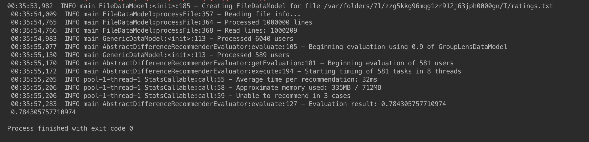
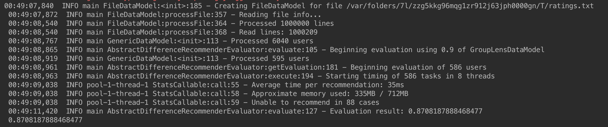
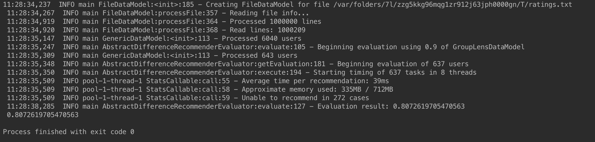
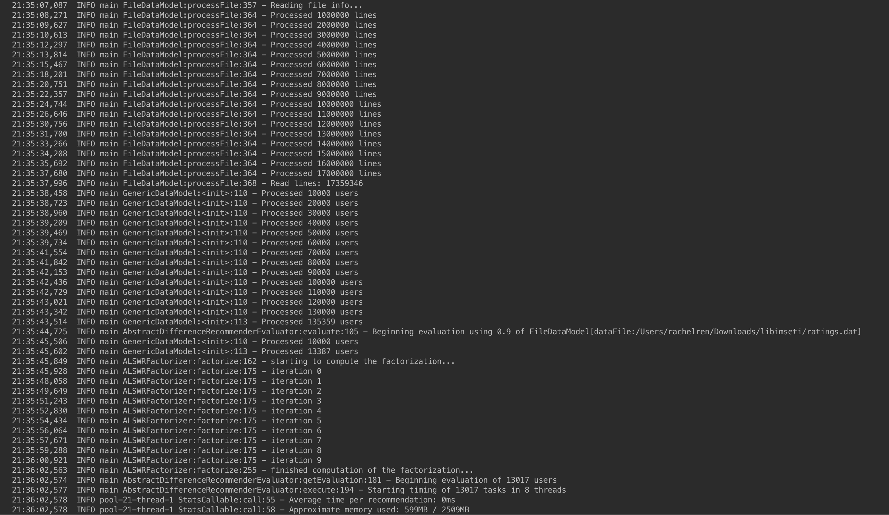
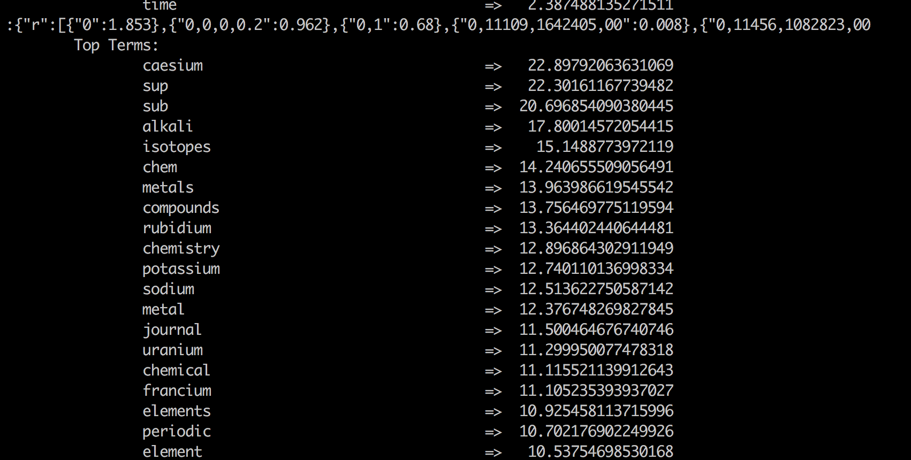
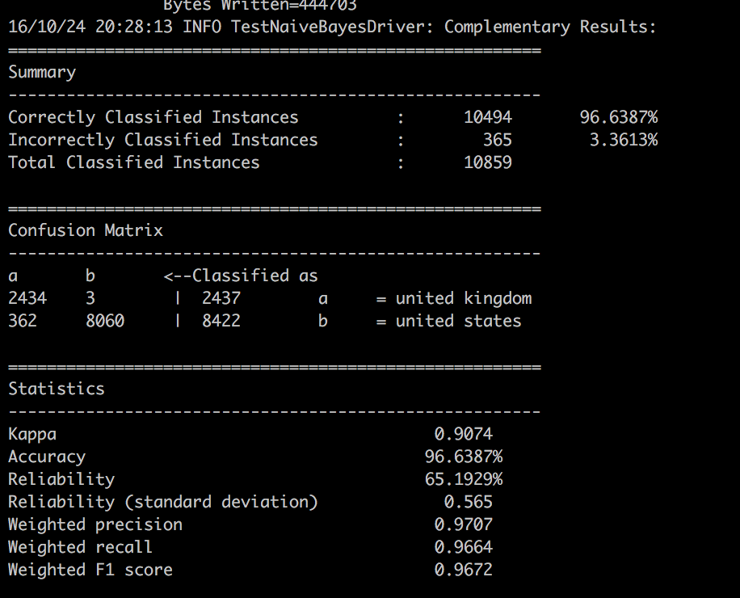

#Homework 2
**EECS E6893_001_2016 Big Data Analytics**   
**Chuqiao Ren**
##Recommendation
In this exercise, I chose 1M rating data from [MovieLens](http://grouplens.org/datasets/movielens/) and rating and gender data from Czech dating site [Libimseti](http://www.occamslab.com/petricek/data/). For each dataset, I chose three difference algorithm to do recommendation: user-based recommender, item-based recommender and Single Value Decomposition-based Recommender.   

But before we jump right into the different algorithm, we need to first construct the data model and define the similarity metric. This can be done by the following code:
```java
DataModel model = new FileDataModel(new File(PATH_TO_FILE));
UserSimilarity usersimilarity = new PearsonCorrelationSimilarity(dataModel);
```
Also, we need to define the notion of a group of most-similar users by the following code in Mahout:
```java
UserNeighborhood userneighborhood = new NearestNUserNeighborhood(100, usersimilarity, dataModel);
```
Note that here I used 100 as the group size. This number highly depends on the nature of dataset.  
After all these pre-process, we can dive into each recommender.

###Exploring the Dataset
GroupLens is a research project that provides several data sets of different sizes, each derived from real users’ ratings of movies. The 10M MovieLens dataset contains 10 million ratings of movies. The format of this data set is different from csv file, but fortunately, Mahout's examples module includes the custom implementation GroupLensDataModel to read this type of file.

The dating data from Czech dating siteLibimseti has 17,359,346 ratings in the data set, and this is almost twice as big as MovieLens data set. Users of Libimseti are able to rate other users' profiles on a scale of 1 to 10. 1 means NELIBI, or dislike and 10 means LBI, or like. That is, the item in this data set is just other people's user profiles. The recommender system built on this data will be recommending people to people. 

###User-Based Recommendation System
The user-based recommender algorithm considers every known item as a candidate for recommendation. It then looks to any other user who has expressed a preference for this candidate item, and sees what their preference value for it was. The values are averaged to come up with an estimate (weighted average). Each preference value is weighted in the average by how similar that user is to the target user.   
  
In Mahout, we can use the GenericUserBasedRecommender by invoking the following code:
```java
Recommender recommender = new GenericUserBasedRecommender(
							dataModel, userneighborhood, usersimilarity);
```

####MovieLens Data
I applied user-based recommender on 1M MovieLens rating data. The code is shown below.
```java
public class MovieLensUserBased {
    public static void main(String[] args){
        try{
            DataModel dataModel = new GroupLensDataModel(
            				new File("/Users/rachelren/Downloads/ml-1m/ratings.dat")); //data
            RecommenderEvaluator evaluator = new AverageAbsoluteDifferenceRecommenderEvaluator();
            RecommenderBuilder recommenderBuilder = new RecommenderBuilder() {
                public Recommender buildRecommender(DataModel dataModel) throws TasteException {
                    UserSimilarity usersimilarity = new PearsonCorrelationSimilarity(dataModel);
                    UserNeighborhood userneighborhood = new NearestNUserNeighborhood(
                    									100, usersimilarity, dataModel);
                    return new GenericUserBasedRecommender(
                    					dataModel, userneighborhood, usersimilarity);
                }
            };
            double score = evaluator.evaluate(
                    recommenderBuilder, null, dataModel, 0.90, 0.10
            );
            System.out.println(score);
        }catch(Exception e){
            System.out.println(e.toString());
        }
    }

}
``` 
The result is is shown below:

It turns out that this recommender can not recommend only 3 cases. The **evaluation value** is the average difference between estimated and actual preference values. The smaller this value is, the better. In this experiment, it is 0.784, which is relatively high. 

#####Experiments on neighborhoods methods
The algorithm we used above are derived from a neighborhood of the 100 most similar users.   

Now if we change the neighborhood size from 100 to 10, we have a worse result.
  
The **evaluation value** becomes 0.871 which is higher than neighborhood size of 100.

Now if we don't want to build a neighborhood of the n most similar users, but rather try to pick the pretty similar users and ignore everyone else, we need to use **threshold-based neighborhood**. 
```java
UserNeighborhood userneighborhood = new ThresholdUserNeighborhood(0.7,usersimilarity, dataModel);
```
Since we used standard Pearson correlation as the similarity metric. Therefore, 0.7 will be a sensible definition of pretty similar.   

The following image shows the result from applying user-based recommender and threshold neighborhood on MovieLens data. The evaluation score is 0.861, which is worse than the neighborhood size 100.


#####Experiments on similarity metrics
The results above are all built upon PearsonCorrelationSimilarity. However, it doesn't take into account the number of items in which two users' preferences overlap. Furthermore, if two users overlap on only one item, no correlation can be computed. Finally, the correlation is also undefined if either series of preference values are all identical.   

Instead of using PearsonCorrelationSimilarity, Mahout also provides a lot of other similarity metrics. Euclidean distance similarity metric is one of them. The implementation is based on the distance between users. It can be applied to MovieLens dataset by the following code:
```java
UserSimilarity usersimilarity = new EuclideanDistanceSimilarity(dataModel);
```

The following image shows the result from Euclidean distance similarity metric. It is still slightly worse than our best result. The evaluation score is around 0.8.


There are also user similarity implementations that ignore preference values entirely. That is, they don't care whether a user expresses a high or low preference for an item, but rather a user expresses a preference at all. One of the method uses Tanimoto coeffcient, which is also known as the Jaccard coefficient. It can be applied to the MovieLens dataset by the following code:
```java
UserSimilarity usersimilarity = new TanimotoCoefficientSimilarity(dataModel);
```
 
Log-likelihood-based similarity is similar to the Tanimoto coefficient-based similarity, where it doesn't take account of individual preference values. It is based on the number of items in common between two users, but its valueis more an expression of how unlikely it is for two users to have so much overlap, given the total number of items out there and the number of items each user has a preference for. It can be applied to the MovieLens dataset by the following code:
```java
UserSimilarity usersimilarity = new LogLikelihoodSimilarity(dataModel);
```

The following image shows the result from Log-likelihood-based similarity metric. It is pretty close to our best result. The evaluation score is around 0.788.


####Czech dating data
Because I have explored difference neighborhood and similarity metrics on MovieLens data, for Czech dating data, I just simply implemented the user-based recommender with Pearson Correlation Similarity metrics. The code is shown as following:
```java
public class CzechDatingUserBased {
    public static void main(String[] args){
        try{
            DataModel dataModel = new FileDataModel(
            						new File("/Users/rachelren/Downloads/libimseti/ratings.dat"));
            RecommenderEvaluator evaluator = new AverageAbsoluteDifferenceRecommenderEvaluator();
            RecommenderBuilder recommenderBuilder = new RecommenderBuilder() {
                public Recommender buildRecommender(DataModel dataModel) throws TasteException {
                    UserSimilarity usersimilarity = new PearsonCorrelationSimilarity(dataModel);
                    UserNeighborhood userneighborhood = new NearestNUserNeighborhood(
                    										100, usersimilarity, dataModel);
                    return new GenericUserBasedRecommender(
                    							dataModel, userneighborhood, usersimilarity);
                }
            };
            double score = evaluator.evaluate(
                    recommenderBuilder, null, dataModel, 0.90, 0.10
            );
            System.out.println(score);
        }catch(Exception e){
            System.out.println(e.toString());
        }
    }
}
```
The following image shows the result from user-based recommendation system with Pearson correlation similarity metric. The evaluation score is around 1.12. Because in this dataset, we want to recommend people to people, the user-based recommender outperformed other recommender.


###Item-Based Recommendation System
The item based algorithm implemented in Mahout will rank each item that a certain user has no preference yet, based on the items that this user has a preference for. It will compute a similarity between these two items. At the end, it will return the top items ranked by weighted average.   

####Reasons that we want to choose item-based recommendation system than a user based recommendation system
- If the number of items is relatively low compared to the number of users, the performance advantage of an item-based recommender will be more significant.
- Items are less subject to change than users. Therefore, item-item similarities are more fixed and reliable.
- We can pre-compute similarities, and this speeds up recommendations at runtime.

####MovieLens Data
I have trained and tested item-based recommendation system on MovieLens Data. The code is implemented as follows:
```java
public class MovieLensItemBased {
    public static void main(String[] args){
        try{
            DataModel dataModel = new GroupLensDataModel(
            						new File("/Users/rachelren/Downloads/ml-1m/ratings.dat"));
            RecommenderEvaluator evaluator = new AverageAbsoluteDifferenceRecommenderEvaluator();
            RecommenderBuilder recommenderBuilder = new RecommenderBuilder() {
                public Recommender buildRecommender(DataModel dataModel) throws TasteException {
                    ItemSimilarity itemSimilarity = new PearsonCorrelationSimilarity(dataModel);
                    return new GenericItemBasedRecommender(dataModel, itemSimilarity);
                }
            };
            double score = evaluator.evaluate(
                    recommenderBuilder, null, dataModel, 0.90, 0.10
            );
            System.out.println(score);
        }catch(Exception e){
            System.out.println(e.toString());
        }
    }

}
```
In this snapshot of code, I used PearsonCorrelationSimilarity as the implementation of ItemSimilarity. The recommender is the GenericItemBasedRecommender.  

The following image shows the result from Item-based recommendation system on MovieLens Data with Pearson Correlation similarity metric. The evaluation score is around 0.854.

Note that in this result, it shows the difference of items between training and testing data. 

I also tried Loglikelihood-based similarity metrics on item-based recommender. The following image shows the result from Item-based recommendation system on MovieLens Data with Pearson Correlation similarity metric. The evaluation score is around 0.818, which is better than Pearson Correlation similarity. I think this is because there are a lot of new items in the testing dataset. For these new item, there is no correlation in the training dataset. Therefore, the result of Pearson Correlation is worse than the loglikelihood similarity.


####Czech dating data

I have trained and tested item-based recommendation system on Czech dating Data. The code is implemented as follows:
```java
public class CzechDatingItemBased {
    public static void main(String[] args){
        try{
            DataModel dataModel = new FileDataModel(
            						new File("/Users/rachelren/Downloads/libimseti/ratings.dat"));
            RecommenderEvaluator evaluator = new AverageAbsoluteDifferenceRecommenderEvaluator();
            RecommenderBuilder recommenderBuilder = new RecommenderBuilder() {
                public Recommender buildRecommender(DataModel dataModel) throws TasteException {
                    ItemSimilarity itemSimilarity = new PearsonCorrelationSimilarity(dataModel);
                    return new GenericItemBasedRecommender(dataModel, itemSimilarity);
                }
            };
            double score = evaluator.evaluate(
                    recommenderBuilder, null, dataModel, 0.90, 0.10
            );
            System.out.println(score);
        }catch(Exception e){
            System.out.println(e.toString());
        }
    }

}
```
In this snapshot of code, I used PearsonCorrelationSimilarity as the implementation of ItemSimilarity. The recommender is the GenericItemBasedRecommender.  

The following image shows the result from Item-based recommendation system on CzechDating Data with Pearson Correlation similarity metric. The evaluation score is around 2.582.


Note that in this result, it shows the difference of items between training and testing data. 

###SVD-Based Recommender
The implementation of SVD Recommender is based on singular value decomposition(SVD). It basically factorize the training matrix and get a loading matrix and a factor matrix. Then it will apply the loading matrix onto the testing data. 

####MovieLens Data
I have trained and tested SVD recommender on Movie Lens dataset. The code is implemented as following:
```java
public class MovieLensSVD {
    public static void main(String[] args){
        try{
            DataModel dataModel = new GroupLensDataModel(
            						new File("/Users/rachelren/Downloads/ml-1m/ratings.dat")); 
            RecommenderEvaluator evaluator = new AverageAbsoluteDifferenceRecommenderEvaluator();
            RecommenderBuilder recommenderBuilder = new RecommenderBuilder() {
                public Recommender buildRecommender(DataModel dataModel) throws TasteException {
                    return new SVDRecommender(
                    			dataModel, new ALSWRFactorizer(dataModel, 10, 0.05, 10));
                }
            };
            double score = evaluator.evaluate(
                    recommenderBuilder, null, dataModel, 0.90, 0.10
            );
            System.out.println(score);
        }catch(Exception e){
            System.out.println(e.toString());
        }
    }

}
```
ALSWRFactorizer is one of the implementation of Factorizer and SVDRecommender is the implementation of SVD-based recommendation system.

The following image shows the result from SVD recommendation system on MovieLens Data. The evaluation score is around 0.745. To factorize the training data, I specified the ALSWRFactorizer to factorize 10 iterations. The difference in items between training data and testing data is also printed onto the screen at the testing stage.


####Czech dating data

Similarly, I have trained and tested SVD recommender on Czech dating dataset. The code is implemented as following:
```java
public class CzechDatingSVD {
    public static void main(String[] args){
        try{
            DataModel dataModel = new FileDataModel(
            						new File("/Users/rachelren/Downloads/libimseti/ratings.dat"));
            RecommenderEvaluator evaluator = new AverageAbsoluteDifferenceRecommenderEvaluator();
            RecommenderBuilder recommenderBuilder = new RecommenderBuilder() {
                public Recommender buildRecommender(DataModel dataModel) throws TasteException {
                    return new SVDRecommender(
                    		dataModel, new ALSWRFactorizer(dataModel, 10, 0.05, 10));
                }
            };
            double score = evaluator.evaluate(
                    recommenderBuilder, null, dataModel, 0.90, 0.10
            );
            System.out.println(score);
        }catch(Exception e){
            System.out.println(e.toString());
        }
    }

}
```

The following image shows the result from SVD recommendation system on Czech dating Data. Because the data set contains more data points than MovieLens data set, the evaluation score is much higher than that of MovieLens data set. It is around 1.73. To factorize the training data, I specified the ALSWRFactorizer to factorize 10 iterations. The difference in items between training data and testing data is also printed onto the screen at the testing stage.  



####Pros and cons of SVD-based recommender
The SVD recommender is among one of the best recommendation system. After applied to the Movie Lens data, it gives one of the best evaluation result. However, the disadvantage of this method is that the implementation computes the SVD in memory, which requires the entire data set to fit in memory. In the future, Mahout will have a new implementation of this method in Hadoop, which will distributed the massive SVD computation across multiple machines. However, this version doesn't come out yet.

####Summary
For the MovieLens data, SVD recommender gives us the best result. This is because SVD recommender can capture the sparsity of the movieLens data. Also, it can capture all the latent factors of the movieLens data set.   

On the other hand, user-based recommender gives us the best result for the Czech dating data set. This is simply because in this data set, we want to recommend user to user. Therefore, user-based recommender is more suitable for this data set.

##Clustering
In this section, I chose K-means and Fuzzy k-means as clustering algorithm. Furthermore, I also tried LDA to find topics. The dataset I used are News data from Reuters and latest articles from Wikipedia. 

###Converting text documents into Vector
We used the Reuters-21578 news collection and Wikipedia's latest news articles.  

First we need to set up the working directory by entering the following code:
```bash
export WORK_DIR = <PATH-TO-WORK-DIR>
```

####Process Reuters news data
Reuters-21578 collection is distributed in 22 files, each of which contains 1000 documents, except for the last one, which contains 578 documents.  

We need to first download data from the Internet, and copy the data to Hadoop. Because the files are in SGML format, which is similar to XML, we need to use `org.apache.lucene.benchmark.utils.ExtractReuters` class to extract the file.
(Suppose we are in the root file of Mahout)
```bash
./bin/mahout org.apache.lucene.benchmark.utils.ExtractReuters ${WORK_DIR}/reuters-sgm ${WORK_DIR}/reuters-out
```
Then we want to convert extracted reuters data to sequence file from director using the `SequenceFileFromDirectory` class.
```bash
./bin/mahout seqdirectory \
	-i ${WORK_DIR}/reuters-out \
	-o ${WORK_DIR}/reuters-out-seqdir \
	-c UTF-8 -chunk 64 -xm sequential
```
Now we are ready to convert the data to vector. 
```bash
./bin/mahou seq2sparse \
    -i ${WORK_DIR}/reuters-out-seqdir/ \
    -o ${WORK_DIR}/reuters-out-seqdir-sparse-kmeans --maxDFPercent 85 --namedVector
```

####Process Wikipedia data
First, we need to download the XML files for the latest Wikipedia articles. Fortunately, TA provides us the partial data along with `categories.txt`. 

Then, we need to run the Wikipedia extractor as follows:
```bash
./bin/mahout seqwiki \
   -c ~/Downloads/Wikipedia/categories.txt \
   -i ~/Downloads/Wikipedia/enwiki-articles.xml \
   -o $WORK_DIR/wikipedia-seqfiles -e
```
(Here, suppose `categories.txt` and `enwiki-articles.xml` are in a folder specified above)  

Now, we are ready to vectorize the sequenced data.
```bash
./bin/mahout seq2sparse \
    -i /tmp/mahout-work-rachelren/wikipedia-seqfiles \
    -o ${WORK_DIR}/wikipedia-out-seqdir-sparse-kmeans --maxDFPercent 85 --namedVector
```


###K-means
K-means is widely used as a clustering algorithm in many fields of science. For good quality clustering using k-means, we need to first figure out the number of clusters, k. In my examples below, I use **20** as the number of clusters. In Mahout, it used EM algorithm. The first step finds the points that are nearest to each centroid point and assigns them to that specific cluster. The second step recalculates the centroid point using the average of the coordinates of all the points in that cluster.

####Reuters data
Because we have prepared the vector data, we can just apply kmeans algorithm from Mahout on this data. The code is shown below:
```bash
./bin/mahout kmeans \
    -i ${WORK_DIR}/reuters-out-seqdir-sparse-kmeans/tfidf-vectors/ \
    -c ${WORK_DIR}/reuters-kmeans-clusters \
    -o ${WORK_DIR}/reuters-kmeans \
    -dm org.apache.mahout.common.distance.EuclideanDistanceMeasure \
    -x 10 -k 20 -ow --clustering
```
Here, we used EuclideanDistanceMeasure. We can use other distance measure as well, like the `SquaredEuclideanDistanceMeasure`. 

The following image shows the directory listing of the output folder. The clusters-* folders are formed at the end of each iteration. They contain information about the clusters. The clusteredPoints folder contains the final mapping from cluster ID to document ID.    


Now, in order to inspect the clusters and see how they are formed, we can use `org.apache.mahout.utils.clustering.ClusterDumper` to show the top terms in each cluster and the documents belong to that cluster.   
```bash
./bin/mahout clusterdump \
    -i ${WORK_DIR}/reuters-kmeans/clusters-*-final \
    -o ${WORK_DIR}/reuters-kmeans/clusterdump \
    -d ${WORK_DIR}/reuters-out-seqdir-sparse-kmeans/dictionary.file-0 \
    -dt sequencefile -b 100 -n 20 --evaluate \
    -dm org.apache.mahout.common.distance.EuclideanDistanceMeasure -sp 0 \
    --pointsDir ${WORK_DIR}/reuters-kmeans/clusteredPoints

cat ${WORK_DIR}/reuters-kmeans/clusterdump
```

The following image shows the top terms in each cluster and the documents belong to that cluster. The first image shows a cluster that is most relevant to the finance, because the top terms are Bank of America, debt and payments. On the other hand, the second image below shows a cluster that is most relevant to transportation. This can be seen from the top terms passenger, load, traffic and airlines.


####Wikipedia data
Because we have prepared the vector data, we can just apply kmeans algorithm from Mahout on this data. The code is shown below:
```bash
./bin/mahout kmeans \
    -i ${WORK_DIR}/wikipedia-out-seqdir-sparse-kmeans/tfidf-vectors/ \
    -c ${WORK_DIR}/wikipedia-kmeans-clusters \
    -o ${WORK_DIR}/wikipedia-kmeans \
    -dm org.apache.mahout.common.distance.EuclideanDistanceMeasure \
    -x 10 -k 20 -ow --clustering
```

The following image shows the directory listing of the output folder. The clusters-* folders are formed at the end of each iteration. They contain information about the clusters. The clusteredPoints folder contains the final mapping from cluster ID to document ID.    


Now, in order to inspect the clusters and see how they are formed, we can use `org.apache.mahout.utils.clustering.ClusterDumper` to show the top terms in each cluster and the documents belong to that cluster.   
```bash
./bin/mahout clusterdump \
    -i ${WORK_DIR}/wikipedia-kmeans/clusters-*-final \
    -o ${WORK_DIR}/wikipedia-kmeans/clusterdump \
    -d ${WORK_DIR}/wikipedia-out-seqdir-sparse-kmeans/dictionary.file-0 \
    -dt sequencefile -b 100 -n 20 --evaluate \
    -dm org.apache.mahout.common.distance.EuclideanDistanceMeasure -sp 0 \
    --pointsDir ${WORK_DIR}/wikipedia-kmeans/clusteredPoints

cat ${WORK_DIR}/wikipedia-kmeans/clusterdump
```

The following image shows the top terms in each cluster and the documents belong to that cluster. The first image shows a cluster that is most relevant to the computer science, because the top terms are Knuth (algorithm), Stanford, programming and algorithms. On the other hand, the second image below shows a cluster that is most relevant to motorcycles. This can be seen from the top terms Bentley, Royce, turbo and motors.


####Constraints of K-means  
Prior to use the k-means algorithm, we need to specify a hard limitation on the number of clusters, k. That is, either we need to first determine the number of clusters, or we need to experiment several different k. 

###Fuzzy K-means
The fuzzy k-means clustering algorithm does a fuzzy form of k-means clustering. Instead of the exclusive clustering in k-means, fuzzy k-means tries to generate overlapping clusters from the data set. 

####Difference between K-means and Fuzzy K-means
K-means algorithm tries to find the hard clusters, where each point belongs to one cluster. But fuzzy k-means discovers the soft clusters. In a soft cluster, any point can belong to more than one cluster with a certain affinity value towards each. Also, the fuzzy k-means algorithm converges faster and better. 


####Reuters data
First, we need to output the vectorized data to a new folder by performing the following command:
```bash
./bin/mahout seq2sparse \
    -i ${WORK_DIR}/reuters-out-seqdir/ \
    -o ${WORK_DIR}/reuters-out-seqdir-sparse-fkmeans --maxDFPercent 85 --namedVector
```

Now, we can apply the fuzzy k-means algorithm to the vectorized data by performing the following command:
```bash
./bin/mahout fkmeans \
    -i ${WORK_DIR}/reuters-out-seqdir-sparse-fkmeans/tfidf-vectors/ \
    -c ${WORK_DIR}/reuters-fkmeans-clusters \
    -o ${WORK_DIR}/reuters-fkmeans \
    -dm org.apache.mahout.common.distance.EuclideanDistanceMeasure \
    -x 10 -k 20 -ow -m 1.1 
```

The following image shows the directory listing of the output folder. The clusters-* folders are formed at the end of each iteration. They contain information about the clusters. The clusteredPoints folder contains the final mapping from cluster ID to document ID.    


Now, in order to inspect the clusters and see how they are formed, we can use `org.apache.mahout.utils.clustering.ClusterDumper` to show the top terms in each cluster and the documents belong to that cluster.   
```bash
./bin/mahout clusterdump \
    -i ${WORK_DIR}/reuters-fkmeans/clusters-*-final \
    -o ${WORK_DIR}/reuters-fkmeans/clusterdump \
    -d ${WORK_DIR}/reuters-out-seqdir-sparse-fkmeans/dictionary.file-0 \
    -dt sequencefile -b 100 -n 20 -sp 0 \
    && \
cat ${WORK_DIR}/reuters-fkmeans/clusterdump
```

The following image shows the top terms in each cluster and the documents belong to that cluster. Clearly, the result of fuzzy k-means is not as good as k-means. Because one word can belong to various clusters, those words like he or U.S. might contribute to all clusters, and they are selected by all clusters to be the top terms. Therefore, fuzzy k-means is not suitable for this data set. 


One of the possible improvement that can be applied to fuzzy k-means is that, we can exclude the common words prior we apply this model. But this requires extra work of pre-processing. 

####Wikipedia data
First, we need to output the vectorized data to a new folder by performing the following command:
```bash
./bin/mahout seq2sparse \
    -i ${WORK_DIR}/wikipedia-seqfiles/ \
    -o ${WORK_DIR}/wikipedia-out-seqdir-sparse-fkmeans --maxDFPercent 85 --namedVector
```

Now, we can apply the fuzzy k-means algorithm to the vectorized data by performing the following command:
```bash
./bin/mahout fkmeans \
    -i ${WORK_DIR}/wikipedia-out-seqdir-sparse-fkmeans/tfidf-vectors/ \
    -c ${WORK_DIR}/wikipedia-fkmeans-clusters \
    -o ${WORK_DIR}/wikipedia-fkmeans \
    -dm org.apache.mahout.common.distance.EuclideanDistanceMeasure \
    -x 10 -k 20 -ow -m 1.1 
```

The following image shows the directory listing of the output folder. The clusters-* folders are formed at the end of each iteration. They contain information about the clusters. The clusteredPoints folder contains the final mapping from cluster ID to document ID.    


Now, in order to inspect the clusters and see how they are formed, we can use `org.apache.mahout.utils.clustering.ClusterDumper` to show the top terms in each cluster and the documents belong to that cluster.   
```bash
./bin/mahout clusterdump \
    -i ${WORK_DIR}/wikipedia-fkmeans/clusters-*-final \
    -o ${WORK_DIR}/wikipedia-fkmeans/clusterdump \
    -d ${WORK_DIR}/wikipedia-out-seqdir-sparse-fkmeans/dictionary.file-0 \
    -dt sequencefile -b 100 -n 20 -sp 0 \
    && \
cat ${WORK_DIR}/wikipedia-fkmeans/clusterdump
```

The following image shows the top terms in each cluster and the documents belong to that cluster. Clearly, the result of fuzzy k-means is not as good as k-means. But compared to Reuters data set, fuzzy K-means works better on the Wikipedia data. The image below shows a cluster that is relevant to chemistry.   


However, not all clusters are good. Because one word can belong to various clusters, those words like he or U.S. might contribute to all clusters, and they are selected by most of the clusters to be the top terms. The image below shows two clusters that have almost identical top terms.


Above all, compared to Reuters data set, fuzzy K-means works better for Wikipedia article data set. I think this is because Wikipedia data set has more data than Reuters data set. Therefore, the overlapping factor might be lower for Wikipedia article data set.
 

###Latent Dirichlet Allocation (LDA)
LDA is a generative model. LDA does this by assuming that the whole corpus has some k number of topics, and each document is talking about these k topics. Therefore, the document is considered a mixture of topics with different probabilities for each. LDA is more powerful than standard clustering because it can both cluster words into
topics and documents into mixtures of topics.  

The CVB algorithm which is implemented in Mahout for LDA combines advantages of both regular Variational Bayes and Gibbs Sampling. The algorithm relies on modeling dependence of parameters on latest variables which are in turn mutually independent. The algorithm uses 2 methodologies to marginalize out parameters when calculating the joint distribution and the other other is to model the posterior of theta and phi given the inputs z and x.


####Reuters Data
First, we need to output the vectorized data to a new folder by performing the following command:
```bash
./bin/mahout seq2sparse \
    -i ${WORK_DIR}/reuters-out-seqdir/ \
    -o ${WORK_DIR}/reuters-out-seqdir-sparse-lda -ow --maxDFPercent 85 --namedVector
```

The tfidf vectors created by the seq2sparse job are SequenceFile. The Mahout RowId job transforms these vectors into a matrix form that is a SequenceFile and a SequenceFile (where the original one is the join of these new ones, on the new int key).
```bash
./bin/mahout rowid \
    -i ${WORK_DIR}/reuters-out-seqdir-sparse-lda/tfidf-vectors \
    -o ${WORK_DIR}/reuters-out-matrix
```

If we performed LDA before, we want to first remove the previous model and folders. Using the following command, we can remove all the folders that might contain model and topics for the previous runs.
```bash
rm -rf ${WORK_DIR}/reuters-lda ${WORK_DIR}/reuters-lda-topics ${WORK_DIR}/reuters-lda-model
```

Now, we can apply the LDA algorithm to the vectorized data by performing the following command:

```bash
./bin/mahout cvb \
    -i ${WORK_DIR}/reuters-out-matrix/matrix \
    -o ${WORK_DIR}/reuters-lda -k 20 -ow -x 20 \
    -dict ${WORK_DIR}/reuters-out-seqdir-sparse-lda/dictionary.file-* \
    -dt ${WORK_DIR}/reuters-lda-topics \
    -mt ${WORK_DIR}/reuters-lda-model
```
In this command, we specified the number of topics to model, –k 10, and a limit on the maximum number of iterations, -x 20.

The following image shows the directory listing of the output folder. The model-* folders are formed at the end of each iteration. They contain information about the topics.


Now, in order to inspect the clusters and see how they are formed, we can use `org.apache.mahout.utils.clustering.ClusterDumper` to show the top terms in each cluster and the documents belong to that cluster.   
```bash
./bin/mahout vectordump \
    -i ${WORK_DIR}/reuters-lda-topics/part-m-00000 \
    -o ${WORK_DIR}/reuters-lda/vectordump \
    -vs 10 -p true \
    -d ${WORK_DIR}/reuters-out-seqdir-sparse-lda/dictionary.file-* \
    -dt sequencefile -sort ${WORK_DIR}/reuters-lda-topics/part-m-00000 \
    && \
  cat ${WORK_DIR}/reuters-lda/vectordump
```

The following image shows the top 10 terms in each document. Use docIndex and `seqdumper` we can easily get a mapping from document to index. Thus, based on topics, we can easily cluster documents with similar topics together. 


####Wikipedia Data
First, we need to output the vectorized data to a new folder by performing the following command:
```bash
./bin/mahout seq2sparse \
    -i ${WORK_DIR}/wikipedia-seqfiles/ \
    -o ${WORK_DIR}/wikipedia-out-seqdir-sparse-lda -ow --maxDFPercent 85 --namedVector
```

The tfidf vectors created by the seq2sparse job are SequenceFile. The Mahout RowId job transforms these vectors into a matrix form that is a SequenceFile and a SequenceFile (where the original one is the join of these new ones, on the new int key).
```bash
./bin/mahout rowid \
    -i ${WORK_DIR}/wikipedia-out-seqdir-sparse-lda/tfidf-vectors \
    -o ${WORK_DIR}/wikipedia-out-matrix
```

If we performed LDA before, we want to first remove the previous model and folders. Using the following command, we can remove all the folders that might contain model and topics for the previous runs.
```bash
rm -rf ${WORK_DIR}/wikipedia-lda ${WORK_DIR}/wikipedia-lda-topics ${WORK_DIR}/wikipedia-lda-model
```

Now, we can apply the fuzzy k-means algorithm to the vectorized data by performing the following command:

```bash
./bin/mahout cvb \
    -i ${WORK_DIR}/wikipedia-out-matrix/matrix \
    -o ${WORK_DIR}/wikipedia-lda -k 20 -ow -x 20 \
    -dict ${WORK_DIR}/wikipedia-out-seqdir-sparse-lda/dictionary.file-* \
    -dt ${WORK_DIR}/wikipedia-lda-topics \
    -mt ${WORK_DIR}/wikipedia-lda-model
```

The following image shows the directory listing of the output folder. The model-* folders are formed at the end of each iteration. They contain information about the topics.


Now, in order to inspect the clusters and see how they are formed, we can use `org.apache.mahout.utils.clustering.ClusterDumper` to show the top terms in each cluster and the documents belong to that cluster.   
```bash
./bin/mahout vectordump \
    -i ${WORK_DIR}/wikipedia-lda-topics/part-m-00000 \
    -o ${WORK_DIR}/wikipedia-lda/vectordump \
    -vs 10 -p true \
    -d ${WORK_DIR}/wikipedia-out-seqdir-sparse-lda/dictionary.file-* \
    -dt sequencefile -sort ${WORK_DIR}/wikipedia-lda-topics/part-m-00000 \
    && \
  cat ${WORK_DIR}/wikipedia-lda/vectordump
```

The following image shows the top 10 terms in each document. Use docIndex and `seqdumper` we can easily get a mapping from document to index. Thus, based on topics, we can easily cluster documents with similar topics together. 


##Classification
In this section, I will use naive Bayes, complementary naive Bayes and stochastic gradient descent (SGD) algorithms to classify 20 newsgroups data and Wikipedia data (Note that for Wikipedia data, I used complementary naive Bayes and binary complementary naive Bayes). 

###Stochastic Gradient Descent (SGD)
Stochastic gradient descent (SGD) is a widely used learning algorithm in which each training example is used to tweak the model slightly to give a more correct answer for that one example. This incremental approach is repeated over many training examples. With some special tricks to decide how much to nudge the model, the model
accurately classifies new data after seeing only a modest number of examples. 

Although SGD algorithms are difficult to parallelize effectively, they’re often so fast that for a wide variety of applications, parallel execution isn’t necessary. Importantly, because these algorithms do the same simple operation for each training example, they require a constant amount of memory. For this reason, each training example requires roughly the same amount of work. These properties make SGD-based algorithms scalable in the sense that twice as much data takes only twice as long to process.

####20 newsgroups data
As what we did in the clustering, we need to first create sequence files from 20 newsgroups data.
```bash
./bin/mahout seqdirectory \
    -i ${WORK_DIR}/20news-all \
    -o ${WORK_DIR}/20news-seq -ow
```

Now, we need to convert sequence files to vectors by performing the following code:
```bash
./bin/mahout seq2sparse \
    -i ${WORK_DIR}/20news-seq \
    -o ${WORK_DIR}/20news-vectors  -lnorm -nv  -wt tfidf
```

Next, we need to split training data and testing data. We will perform a random 80-20 split of the vector data set.

```bash
./bin/mahout split \
    -i ${WORK_DIR}/20news-vectors/tfidf-vectors \
    --trainingOutput ${WORK_DIR}/20news-train-vectors \
    --testOutput ${WORK_DIR}/20news-test-vectors  \
    --randomSelectionPct 40 --overwrite --sequenceFiles -xm sequential
```

We will train the data set using `org.apache.mahout.classifier.sgd.TrainNewsGroups` class.
```bash
./bin/mahout org.apache.mahout.classifier.sgd.TrainNewsGroups \
				${WORK_DIR}/20news-bydate/20news-bydate-train/
```
Then, we can test the stand-alone data using `org.apache.mahout.classifier.sgd.TestNewsGroups` class.
```bash
./bin/mahout org.apache.mahout.classifier.sgd.TestNewsGroups \
				--input ${WORK_DIR}/20news-bydate/20news-bydate-test/ --model /tmp/news-group.model
```

###Naive Bayes and Complementary Naive Bayes
The naive Bayes and complementary naive Bayes algorithms in Mahout are parallelized algorithms that can be applied to larger data sets than are practical with SGDbased algorithms. Because they can work effectively on multiple
machines at once, these algorithms will scale to much larger training data sets than will the SGD-based algorithms.  

The Mahout implementation of naive Bayes, however, is restricted to classification based on a single text-like variable. For many problems, including typical large data problems, this requirement isn’t a problem. But if continuous variables are needed and they can’t be quantized into word-like objects that could be lumped in with other text data, it may not be possible to use the naive Bayes family of algorithms. In addition, if the data has more than one categorical word-like or text-like variable, it’s possible to concatenate your variables together, disambiguating them by prefixing
them in an unambiguous way. This approach may lose important distinctions because the statistics of all the words and categories get lumped together. Most text classification problems, however, should work well with naive Bayes or complementary naive Bayes.

####Difference between Naive Bayes and Complementary Naive Bayes
Complement naive Bayes is an naive Bayes variant that tends to work better than the vanilla version when the classes in the training set are imbalanced. The Complementary Naive Bayes classifier improves upon the weakness of the Naive Bayes classifier by estimating parameters from data in all sentiment classes except the one which we are evaluating for. One can read more [here](http://stackoverflow.com/questions/20694184/differences-between-standardnaivebayesclassifier-and-complementarynaivebayesclas).

####20 newsgroups data
As what we did in the clustering, we need to first create sequence files from 20 newsgroups data.
```bash
./bin/mahout seqdirectory \
    -i ${WORK_DIR}/20news-all \
    -o ${WORK_DIR}/20news-seq -ow
```

Now, we need to convert sequence files to vectors by performing the following code:
```bash
./bin/mahout seq2sparse \
    -i ${WORK_DIR}/20news-seq \
    -o ${WORK_DIR}/20news-vectors  -lnorm -nv  -wt tfidf
```

Next, we need to split training data and testing data. We will perform a random 80-20 split of the vector data set.

```bash
./bin/mahout split \
    -i ${WORK_DIR}/20news-vectors/tfidf-vectors \
    --trainingOutput ${WORK_DIR}/20news-train-vectors \
    --testOutput ${WORK_DIR}/20news-test-vectors  \
    --randomSelectionPct 40 --overwrite --sequenceFiles -xm sequential
```

Now, if we want to train our data on **complementary naive Bayes**, we want to perform the following code
```bash
./bin/mahout trainnb \
        -i ${WORK_DIR}/20news-train-vectors \
        -o ${WORK_DIR}/model \
        -li ${WORK_DIR}/labelindex \
        -ow -c
```
Please note the `-c` parameter at the very end. This indicating that this code will run complementary naive Bayes algorithm.

Otherwise, we can train our data on **Naive Bayes algorithm** by performing the following code:
```bash
./bin/mahout trainnb \
        -i ${WORK_DIR}/20news-train-vectors \
        -o ${WORK_DIR}/model \
        -li ${WORK_DIR}/labelindex \
        -ow
```

After constructing the model, we are able to classify our training data set and see if our model can correctly classify each data point. The following code is for **complementary naive Bayes**.
```bash
./bin/mahout testnb \
        -i ${WORK_DIR}/20news-train-vectors\
        -m ${WORK_DIR}/model \
        -l ${WORK_DIR}/labelindex \
        -ow -o ${WORK_DIR}/20news-testing
        -c
```
The following code is for **Naive Bayes**.
```bash
./bin/mahout testnb \
        -i ${WORK_DIR}/20news-train-vectors\
        -m ${WORK_DIR}/model \
        -l ${WORK_DIR}/labelindex \
        -ow -o ${WORK_DIR}/20news-testing
```
Again, the only difference for two method is the indicator `-c` at the very end of the code.

The following image shows testing result for training data set of **complementary naive Bayes**. It shows that **98%** of the data are correctly classified. The precision is 0.9878, which means that our model works very well on predicting back the training data set. This indicates that our model can fully express the training data set. Also, there is a confusion matrix in the middle. The diagonal number of a confusion matrix indicates those instances with correct prediction label. This confusion matrix shows that our model works great on training data set.


The following image shows testing result for training data set of **Naive Bayes**. It shows that **99%** of the data are correctly classified. The precision is 0.992, which means that our model works very well on predicting back the training data set. This indicates that our model can fully express the training data set. Also, there is a confusion matrix in the middle. The diagonal number of a confusion matrix indicates those instances with correct prediction label. This confusion matrix shows that our model works great on training data set.


However, high precision on training data set doesn't represent that our model can work on all other data set. That is, we cannot yet prove that our model doesn't overfit training data set. Therefore, we want to further test our model on a testing data set which has the minimized overlapping with our training data set, yet can represent similar features with our training set. We can use the following code to test on the stand-alone testing data set:
(**Complementary Naive Bayes Version**)
```bash
./bin/mahout testnb \
        -i ${WORK_DIR}/20news-test-vectors\
        -m ${WORK_DIR}/model \
        -l ${WORK_DIR}/labelindex \
        -ow -o ${WORK_DIR}/20news-testing -c
```
(**Naive Bayes Version**)
```bash
./bin/mahout testnb \
        -i ${WORK_DIR}/20news-test-vectors\
        -m ${WORK_DIR}/model \
        -l ${WORK_DIR}/labelindex \
        -ow -o ${WORK_DIR}/20news-testing
```

The following image shows testing result for testing data set of **complementary naive Bayes**. It shows that **89%** of the data are correctly classified. The precision is 0.892, which means that our model works very well on predicting the stand-alone testing data set. Also, there is a confusion matrix in the middle. The diagonal number of a confusion matrix indicates those instances with correct prediction label. Note that non-diagonal entries for this confusion matrix are either 0 or smaller number. This shows that our model works great on testing data set.


The following image shows testing result for testing data set of **Naive Bayes**. It shows that **90%** of the data are correctly classified. The precision is 0.91, which means that our model works very well on predicting the stand-alone testing data set. Also, there is a confusion matrix in the middle. The diagonal number of a confusion matrix indicates those instances with correct prediction label. Note that non-diagonal entries for this confusion matrix are either 0 or smaller number. This shows that our model works great on testing data set.


####Wikipedia data
For Wikipedia data, I used **complementary naive Bayes algorithm** and **binary complementary Naive Bayes algorithm**.

#####Prepare Data
######Complementary Naive Bayes
For complementary Naive Bayes, we need to converting sequence files to vectors using bigrams.
```bash
./bin/mahout seq2sparse -i ${WORK_DIR}/wikipediainput \
                        -o ${WORK_DIR}/wikipediaVecs \
                        -wt tfidf \
                        -lnorm -nv \
                        -ow -ng 2
```

######Binary Complementary Naive Bayes
For Binary Complementary Naive Bayes, we need to convert sequence files to vectors using unigrams and a max document frequency of 30%
```bash
./bin/mahout seq2sparse -i ${WORK_DIR}/wikipediainput \
                        -o ${WORK_DIR}/wikipediaVecs \
                        -wt tfidf \
                        -lnorm \
                        -nv \
                        -ow \
                        -ng 1 \
                        -x 30
```

#####Training and Testing
We need to first create training and holdout set with a random 80-20 split of the generated vector dataset
```bash
./bin/mahout split -i ${WORK_DIR}/wikipediaVecs/tfidf-vectors/ \
                   --trainingOutput ${WORK_DIR}/training \
                   --testOutput ${WORK_DIR}/testing \
                   -rp 20 \
                   -ow \
                   -seq \
                   -xm sequential
```

Now, we need to train Naive Bayes Model for both algorithms. Note that because both algorithm use complementary Naive Bayes, we need to add `-c` at the end of training code.
```bash
./bin/mahout trainnb -i ${WORK_DIR}/training \
                     -o ${WORK_DIR}/model \
                     -li ${WORK_DIR}/labelindex \
                     -ow \
                     -c
```

We want to first test on the training data set to validate our model.
```bash
./bin/mahout testnb -i ${WORK_DIR}/training \
                    -m ${WORK_DIR}/model \
                    -l ${WORK_DIR}/labelindex \
                    -ow \
                    -o ${WORK_DIR}/output \
                    -c
```
The following image shows testing result for training data set of **Complementary Naive Bayes**. It shows that **99.6%** of the data are correctly classified. The precision is 0.996, which means that our model works very well on predicting the stand-alone testing data set. Also, there is a confusion matrix in the middle. The diagonal number of a confusion matrix indicates those instances with correct prediction label. Note that non-diagonal entries for this confusion matrix are either 0 or smaller number. This shows that our model works great on testing data set.


The following image shows testing result for training data set of **Binary Complementary Naive Bayes**. It shows that **96.6%** of the data are correctly classified. The precision is 0.971, which means that our model works very well on predicting the stand-alone testing data set. Also, there is a confusion matrix in the middle. Because our algorithm is binary, there are only two classes, United Kingdom and United States. The diagonal number of a confusion matrix indicates those instances with correct prediction label. Note that non-diagonal entries for this confusion matrix are either 0 or smaller number. This shows that our model works great on testing data set.



Then, we can test on the stand-alone test data set, using standard Naive Bayes.
```bash
./bin/mahout testnb -i ${WORK_DIR}/testing \
                    -m ${WORK_DIR}/model \
                    -l ${WORK_DIR}/labelindex \
                    -ow \
                    -o ${WORK_DIR}/output \
                    -seq
```

The following image shows testing result for testing set of **Complementary Naive Bayes**. This test is based on **standard Naive Bayes**. It shows that **85.7%** of the data are correctly classified. The precision is 0.89, which means that our model works very well on predicting the stand-alone testing data set. Also, there is a confusion matrix in the middle. The diagonal number of a confusion matrix indicates those instances with correct prediction label. Note that non-diagonal entries for this confusion matrix are either 0 or smaller number. This shows that our model works great on testing data set.


The following image shows testing result for testing data set of **Binary Complementary Naive Bayes**. This test is based on **standard Naive Bayes**. It shows that **95.4%** of the data are correctly classified. The precision is 0.957, which means that our model works very well on predicting the stand-alone testing data set. Also, there is a confusion matrix in the middle. Because our algorithm is binary, there are only two classes, United Kingdom and United States. The diagonal number of a confusion matrix indicates those instances with correct prediction label. Note that non-diagonal entries for this confusion matrix are either 0 or smaller number. This shows that our model works great on testing data set.


Now, we can test on the stand-alone test data set using complementary Naive Bayes.
```bash
./bin/mahout testnb -i ${WORK_DIR}/testing \
                    -m ${WORK_DIR}/model \
                    -l ${WORK_DIR}/labelindex \
                    -ow \
                    -o ${WORK_DIR}/output  \
                    -c \
                    -seq
```

The following image shows testing result for training data set of **Complementary Naive Bayes**. This test is based on **complementary Naive Bayes**. It shows that **85.6%** of the data are correctly classified. The precision is 0.916, which means that our model works very well on predicting the stand-alone testing data set. Also, there is a confusion matrix in the middle. The diagonal number of a confusion matrix indicates those instances with correct prediction label. Note that non-diagonal entries for this confusion matrix are either 0 or smaller number. This shows that our model works great on testing data set.


The following image shows testing result for testing data set of **Binary Complementary Naive Bayes**. This test is based on **complementary Naive Bayes**. It shows that **86.6%** of the data are correctly classified. The precision is 0.913, which means that our model works very well on predicting the stand-alone testing data set. Also, there is a confusion matrix in the middle. Because our algorithm is binary, there are only two classes, United Kingdom and United States. The diagonal number of a confusion matrix indicates those instances with correct prediction label. Note that non-diagonal entries for this confusion matrix are either 0 or smaller number. This shows that our model works great on testing data set.


##Spark
I used brew to install spark.
```
brew install spark
```


I have integrated Spark with Hadoop and Scala. The following code is the simple word count program in Spark written in Scala. I will count document No. 40062 in 20 news groups data under computer graphics category.
```scala
object wordCount {
  def main(args: Array[String]): Unit = {
    val conf = new SparkConf()
      .setAppName("WordCount")
      .setMaster("local[2]")
      .set("spark.executor.memory","1g")
    val sc = new SparkContext(conf)
    val textFile = sc.textFile("/tmp/mahout-work-rachelren/20news-all/comp.graphics/40062")
    val counts = textFile.flatMap(line => line.split(" "))
      .map(word => (word, 1))
      .reduceByKey(_ + _)

    counts.foreach(println)

    counts.saveAsTextFile("/tmp/wordCount")
  }

}
```
The following image shows the frequency of each word in the document. This is only a partial list of the (word, frequency) pair.  


